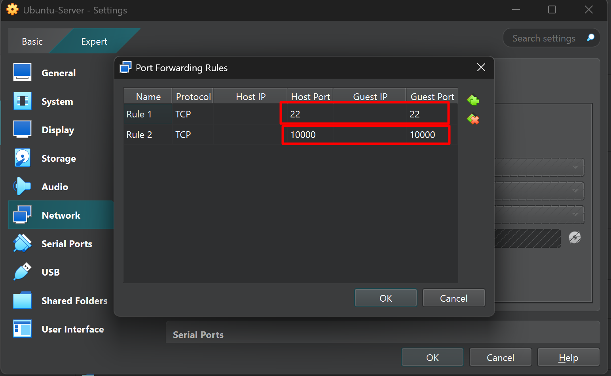
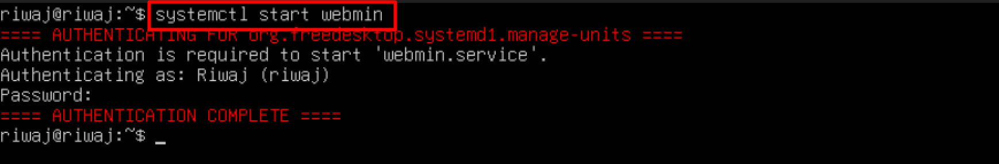
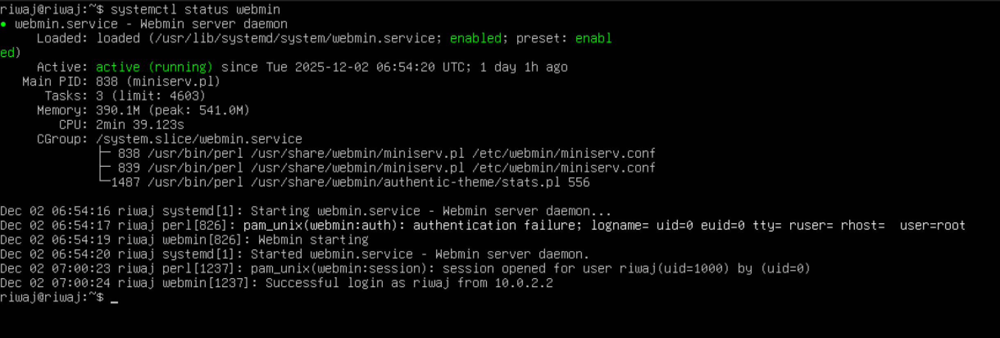
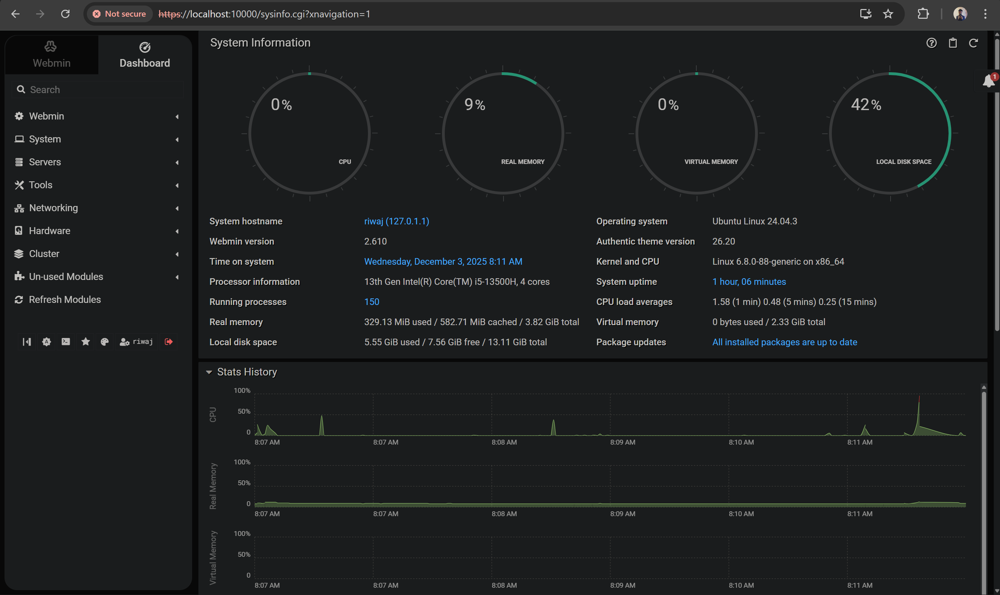

# Run Webmin on a CLI based ViM

## Installation

1. Download the webmin repo and execute the script

    ```bash
    curl -o webmin-setup-repo.sh https://raw.githubusercontent.com/webmin/webmin/master/webmin-setup-repo.sh
    
    sudo sh webmin-setup-repo.sh
    ```

2. Install webmin in the server

    ```bash
    sudo apt-get install webmin --install-recommends
    ```

3. Enabling port for the VM

 

4. Starting and Verifying webmin service

 

  

5. verfiying from web login

 
