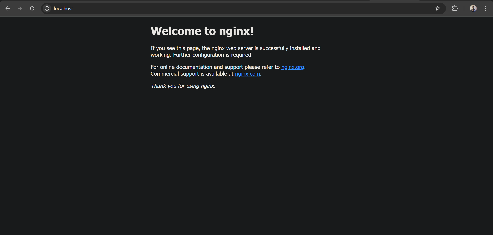
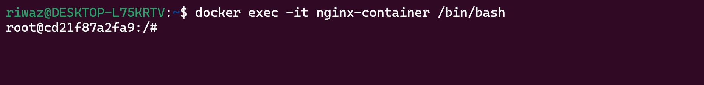
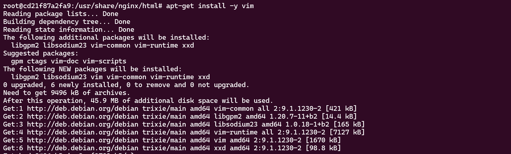
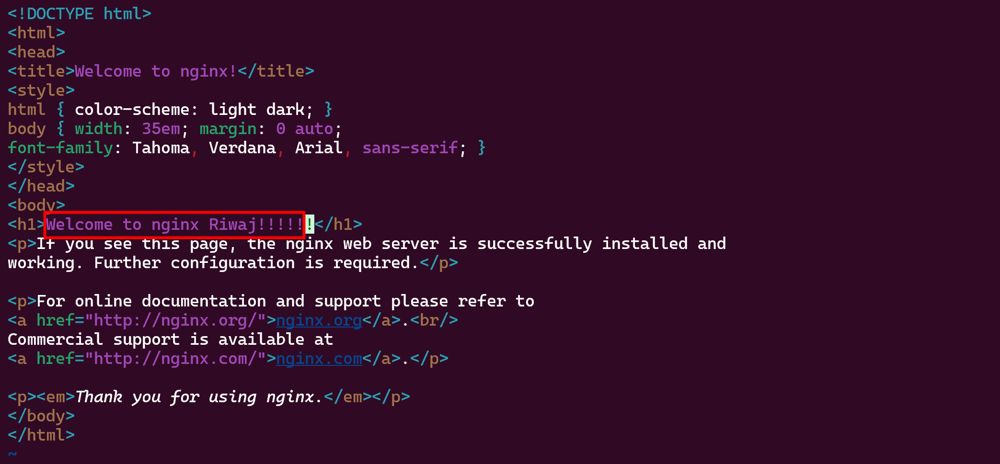
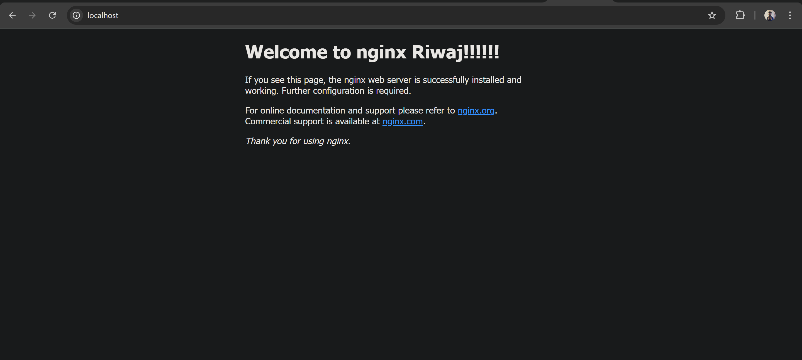
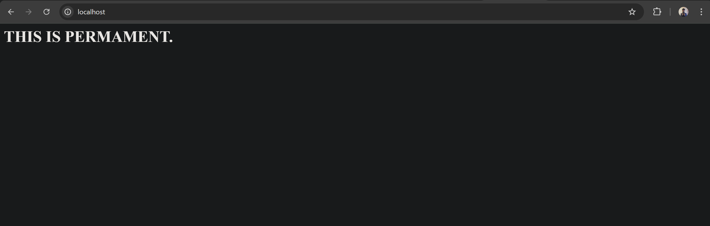

# Docker Assigment with Persistant Volume

## Instructions

- Pull a NGINX or httpd container.

- Browse the default page in http://localhost

- Alter the default content.

- Stop and start the container again and check if the content persists.

- Remove the container and spin it again and check the persistence again.

- If content does not persist, try different ways to make it persistence.

## 1. Pull Nginx Image

    ```bash
    docker pull nginx:1.29
    ```

## 2. Run a Docker container with that Image

    ```bash
    docker run -d --name nginx-container -p 80:80 nginx:1.29
    ```

    ```bash
    docker ps    
    ```


## 3. Verifying from the browser



## 4. ALtering the default content of nginx server

    ```bash
    docker exec -it nginx-container /bin/bash
    ```


### 4.1 Taking backup

    ```bash
    cd /usr/share/nginx/html
    cp index.html index.html.BP
    ```

### 4.2 Installing vim inside container

    ```bash
    apt-get install -y vim
    ```


### 4.3 Editing the index file



### 4.4 Verifying the changes



## 5. Persistance test failure

    ```bash
    docker stop nginx-container
    ```
    ```bash
    docker rm nginx-container
    ```
    ```bash
    docker run -d --name nginx-container -p 80:80 nginx:1.29
    ```


## 6. Using volume mount

    ```bash
    echo "<h1>THIS IS PERMAMENT!!!!!</h1>" > index.html
    ```
### 6.1 Using Bind mounts

    ```bash
    docker run -d --name nginx-container -v /home/riwaz/index.html:/usr/share/nginx/html/index.html -p 80:80 nginx:1.29
    ```
### 6.2 verifying


