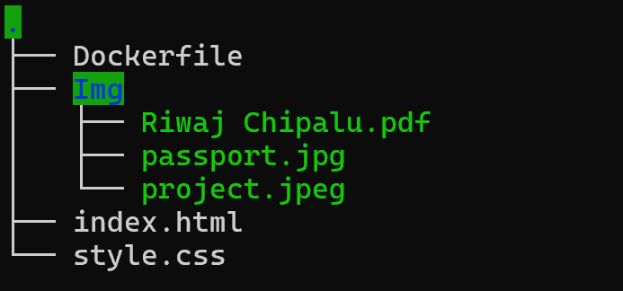
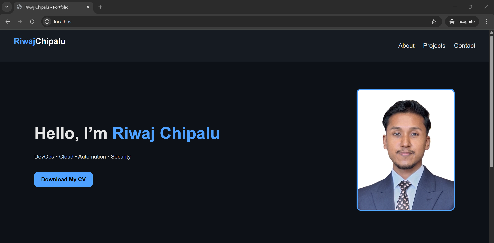

# Portfolio Website Docker Image

## Task: Create a Docker image that serves a portfolio website containing at least two images and a button to download a CV.

## Overview

    This repository contains a minimal static portfolio website and a Dockerfile to build a Docker image that serves the site using a lightweight web server. The site includes:

    - A homepage with at least two images (profile/project images).

    - A Download CV button that triggers the download of a CV.pdf file.

## File Structure

 

## DOckerfile

Use this dockerfile to create an image that serves the static file.

```bash
FROM nginx:alpine

WORKDIR /app

RUN rm -rf /usr/share/nginx/html/*

COPY . /usr/share/nginx/html

EXPOSE 80

CMD ["nginx", "-g", "daemon off;"]
```

## index.html

Basic HTML file of the portfolio site.

```bash
<!DOCTYPE html>
<html lang="en">
<head>
    <meta charset="UTF-8">
    <title>Riwaj Chipalu - Portfolio</title>
    <link rel="stylesheet" href="style.css">
</head>
<body>

<div class="container">
    <h1>Hello, I’m <span class="name">Riwaj Chipalu</span></h1>
    <p class="subtitle">DevOps • Cloud • Automation</p>

    

    <p class="about">
        I’m passionate about cloud infrastructure, DevOps automation, and building secure,
        scalable systems. This mini-portfolio runs entirely inside a Docker container.
    </p>

    <h2>Featured Project</h2>
    
    <p class="project-desc">
        A CI/CD pipeline project using Jenkins, Docker, SonarQube, OWASP and trivy.
    </p>

    <a href="Img/Riwaj Chipalu.pdf" download class="cv-button">Download My CV</a>
</div>

</body>
</html>
```

## style.css

```bash
body {
    font-family: Arial, sans-serif;
    background: #f7f7f7;
    margin: 0;
    padding: 0;
    text-align: center;
}

.container {
    width: 60%;
    margin: auto;
    padding: 40px;
    background: white;
    margin-top: 40px;
    border-radius: 10px;
}

.name { color: #0078ff; }

.profile-img {
    width: 180px;
    border-radius: 50%;
    margin: 20px 0;
}

.project-img {
    width: 80%;
    border-radius: 10px;
    margin-top: 20px;
}

.cv-button {
    display: inline-block;
    padding: 12px 20px;
    background: #0078ff;
    color: white;
    text-decoration: none;
    border-radius: 6px;
    margin-top: 20px;
    font-size: 18px;
}

.cv-button:hover {
    background: #005fcc;
}
```

## Build the Docker image from Dockerfile

```bash
docker build -t rexxx9865/adex-devops:latest .
```

## Verify the built image

```bash
docker images
```

## Run the container with the built docker image

```bash
docker run -d --name riwaj-container -p 80:80 rexxx9865/adex-devops:latest
```

## Verify the spinned container

### 1. CLI

```bash
dokcker ps
```

### 2. curl

```bash
curl localhost
``` 

### 3. Via Browser



## Push the Docker Image to DockerHub

### 1. Login to Docker

```bash
docker login
```

### 2. Push your image

```bash
docker push rexxx9865/adex-devops:latest
```
