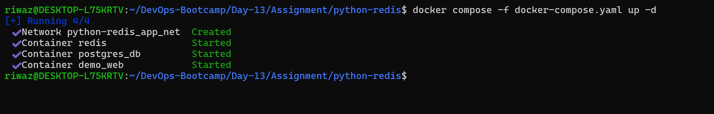
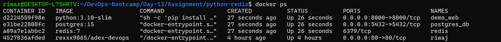
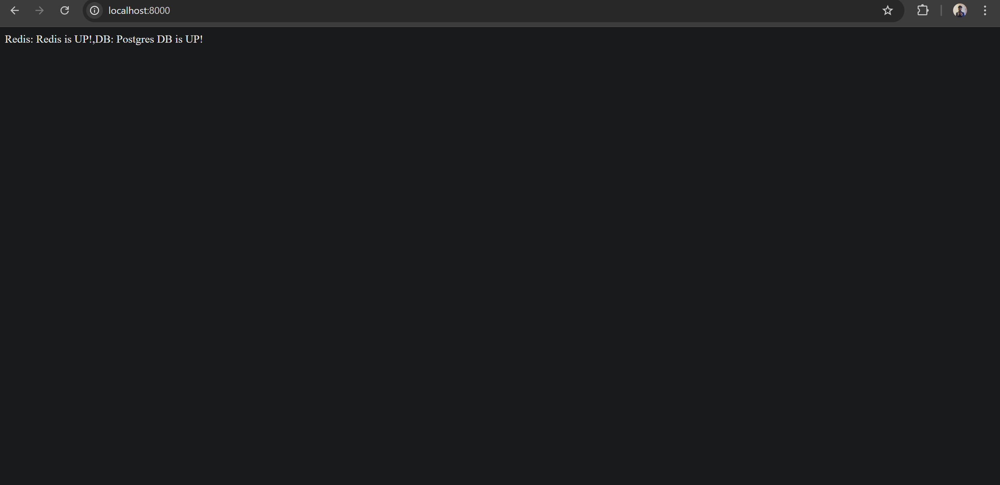

# Task: Redis and Postgres DB Status check from Python

    Forked repo from  https://github.com/adex-devops-bootcamp/python-redis
    
## Adding postgres DB configurations in docker compose file

```bash
db:
     image: postgres:15
     container_name: postgres_db
     environment:
       POSTGRES_USER: user
       POSTGRES_PASSWORD: password
       POSTGRES_DB: postdb
     ports:
       - "5432:5432"
     networks:
       - app_net
```

## Updating our application file (app.py)

```bash
from flask import Flask
import redis
import os
import psycopg2

app = Flask(__name__)

r = redis.Redis(host="redis", port=6379)

DB_HOST = os.getenv("DB_HOST", "db")
DB_USER = os.getenv("POSTGRES_USER", "user")
DB_PASSWORD = os.getenv("POSTGRES_PASSWORD", "password")
DB_NAME = os.getenv("POSTGRES_DB", "postdb")

@app.route("/")
def check_redis():
    try:
        r.ping()
        redis_status = "Redis is UP!"
    except:
        redis_status = "Redis is DOWN!"

    db_status = check_database()
    return f"Redis: {redis_status},DB: {db_status}"

def check_database():
    try:
        conn = psycopg2.connect(
            host=DB_HOST,
            user=DB_USER,
            password=DB_PASSWORD,
            dbname=DB_NAME,
            connect_timeout=2
        )
        conn.close()
        return "Postgres DB is UP!"
    except:
        return "Postgres DB is DOWN!"

if __name__ == "__main__":
    app.run(host="0.0.0.0", port=8000)


```

## Updating requirements.txt

```bash
flask
redis
psycopg2-binary
```

## Starting the container

```bash
docker compose -f docker-compose.yaml up -d
```




## Verifying the status of containers



## Verifying the application via browser


