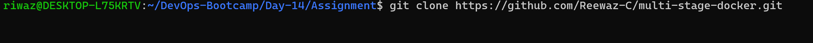
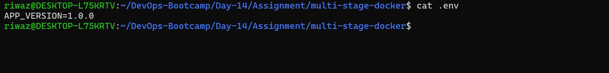
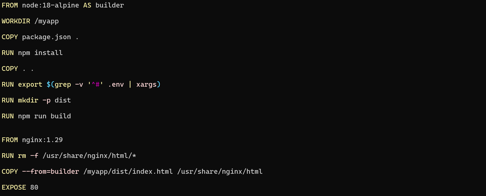
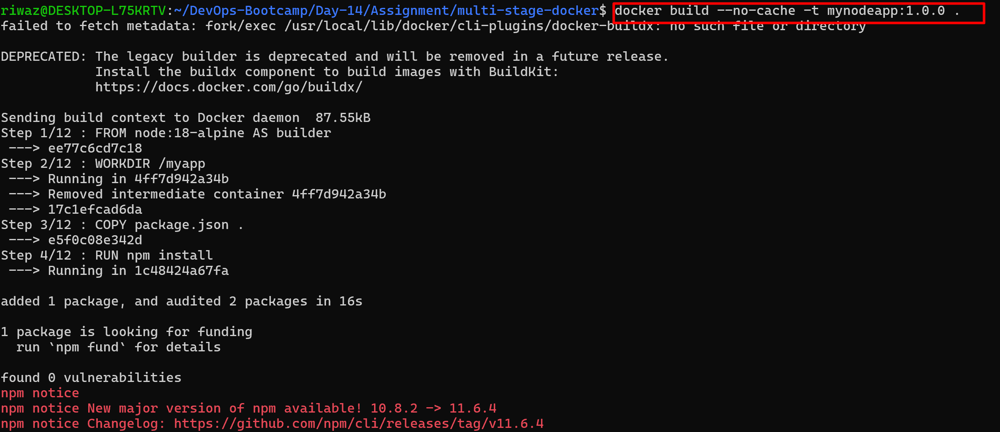
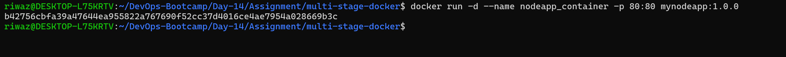
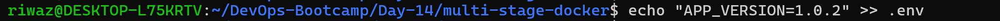
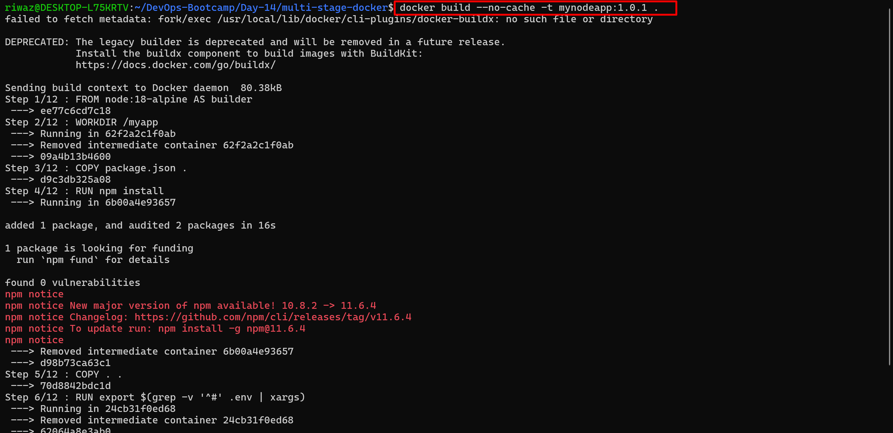
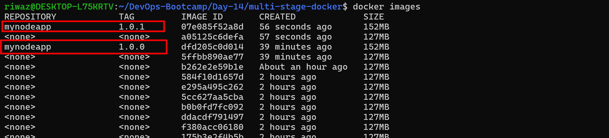
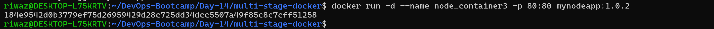
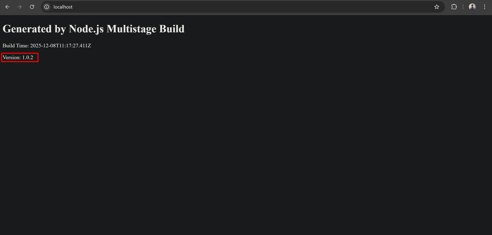

# Containerize NodeJS App with Multi Stage Docker Build

1. Fork or copy GitHub - adex-devops-bootcamp/multi-stage-docker 
2. Generate a lighweight Dockerfile
3. Put screenshots in the comments or documentation of building the app with different version tags (Hint: .env)

## 1. Cloning the forked repo



## 2. Creating .env file



## 3. Creating Dockerfile



## 4. Build Docker Image from the file



## 5. Running the container with the built image



### 5.1 Verification of container

```bash
docker ps
```

### 5.2 Verification of application


## 6. Updating the app version

### 6.1 Version updated in .env file



### 6.2 Building new docker Image with updated app version

 

### 6.3 Verification of built image with updated tag



### 6.4 Running the container with updated Image



### 6.5 Verification of updated application version

```bash
curl localhost
```


