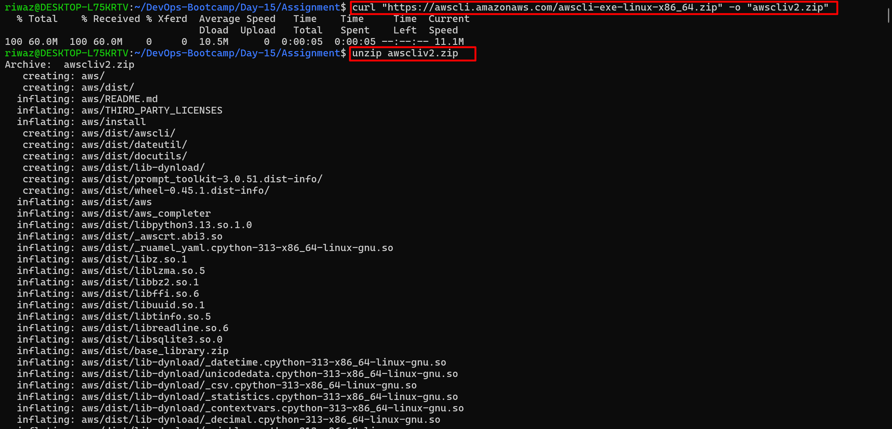

# Task Day 15

- **Install and Configure AWS CLI**
- **List created S3 Bucket**
- **Harden the credentials**

## 1. Installing AWS CLI




## 2. Configuring AWS CLI


## 3. Creating a S3 bucket


### 3.1 Listing the created bucket using AWS CLI


## 4. Hardening Credentials

When working with AWS, securely managing your credentials is crucial. Mishandling can lead to unauthorized access and potential security breaches.


### **4.1 Use IAM Roles and Follow the Principle of Least Privilege**

After securing the root account with Multi-Factor Authentication (MFA), the next critical step in hardening your AWS environment is enforcing **least privilege access** through the correct use of **IAM roles**. Also never use the root account for daily operations.

```jsx
aws iam create-user --user-name devops-user
aws iam add-user-to-group --user-name devops-user --group-name S3AccessGroup
```

### 4.2 **Use Access Keys Securely**

When using AWS CLI, access keys (the **`AWS_ACCESS_KEY_ID`** and `AWS_SECRET_ACCESS_KEY`) are the primary credentials for programmatic access. To maintain security, these keys should **never be hardcoded directly into scripts, code repositories, or configuration files** that might be shared or version-controlled, as this can lead to credential leaks and potential unauthorized access.

Instead, AWS provides the use of **profiles** through the `~/.aws/credentials` file, allowing you to define multiple sets of credentials for different accounts or roles.


### 4.3 **Rotate Credentials Regularly**

Regularly rotating AWS credentials is a critical practice for maintaining the security of your cloud environment. Long-term access keys that are never changed pose a significant risk if they are accidentally exposed or compromised. To mitigate this, you should create new access keys periodically and replace the old ones, ensuring that no key remains active indefinitely.

AWS also provides mechanisms for **temporary credentials** through IAM roles or the Security Token Service (STS), which automatically expire after a defined period reducing the risk associated with older credentials. 

```jsx
aws sts get-session-token --duration-seconds 3600
```


Here we can see the command aws sts get-session-token --duration-seconds 3600 is used to retrieve a set of temporary security credentials from AWS STS. This credentials will be vailed till 1 hour.
