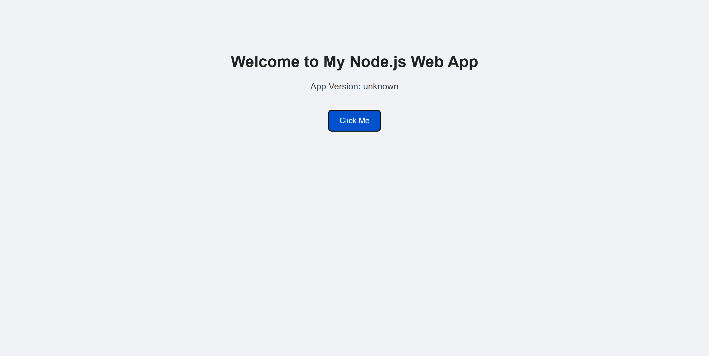
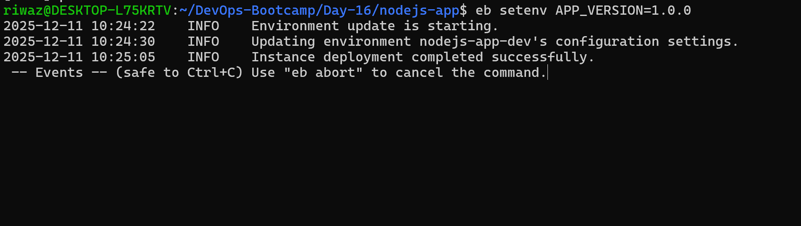
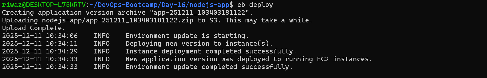
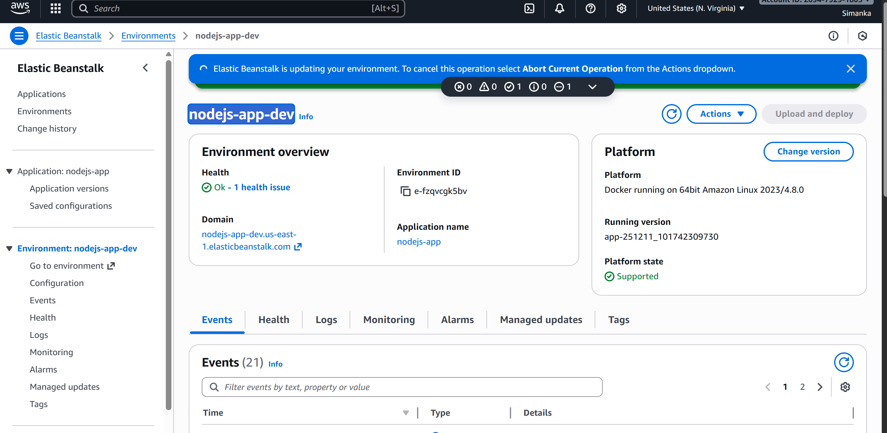
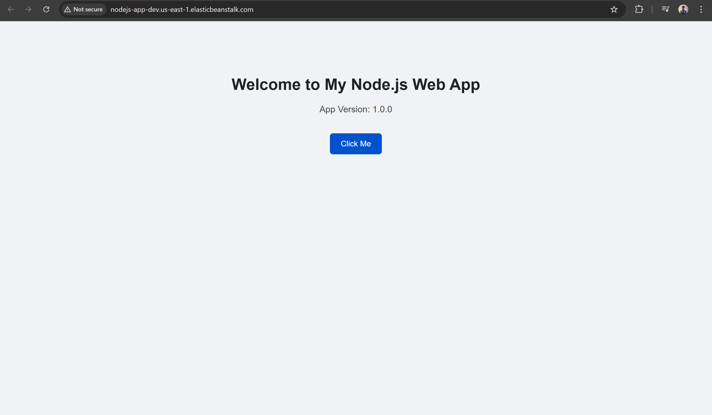
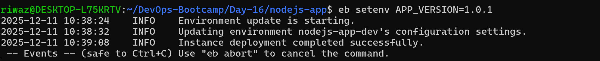

# PaaS - Deploy a Nodejs app  in AWS ElasticBean

This project generates a static HTML website using Node.js and builds it using a **Dockerfile.**

The  application is deployed to **AWS Elastic Beanstalk (EB).**

## Project structure

## Building a Docker Image

## Installing pipx

## Installing awsebcli

## Initializing Elastic Beanstalk

## Application created in Elastic Beanstalk but it does not contain anything yet

## Creating Environment

## Verifying the deployment

## Adding the app version as env variable

## Deploying the elastic bean stalk

## Modifying the version

