# PaaS - Deploy a Nodejs app  in AWS ElasticBean

This project generates a static HTML website using Node.js and builds it using a **Dockerfile.**

The  application is deployed to **AWS Elastic Beanstalk (EB).**

## Project structure

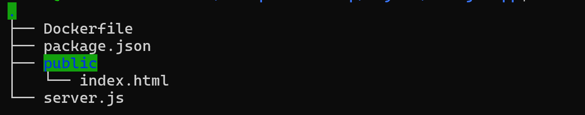

## Building a Docker Image

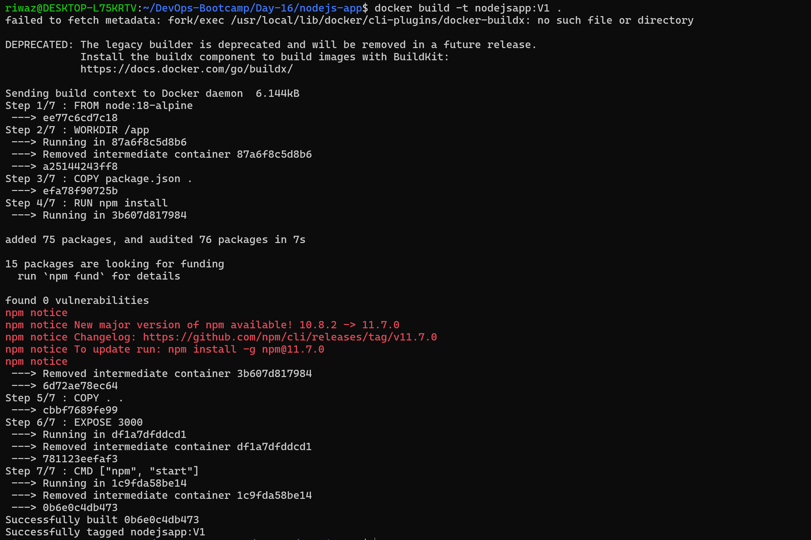

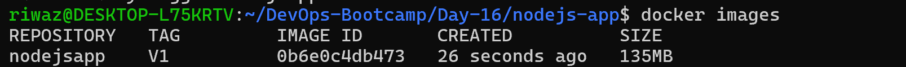

## Installing pipx

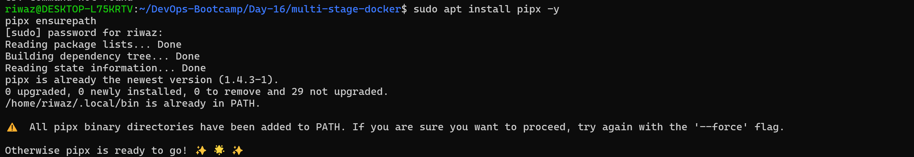

## Installing awsebcli

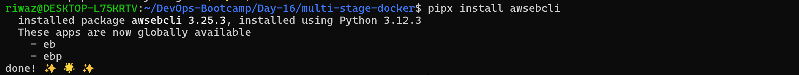

## Initializing Elastic Beanstalk

## Application created in Elastic Beanstalk but it does not contain anything yet

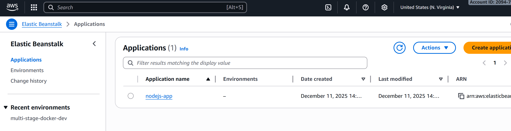

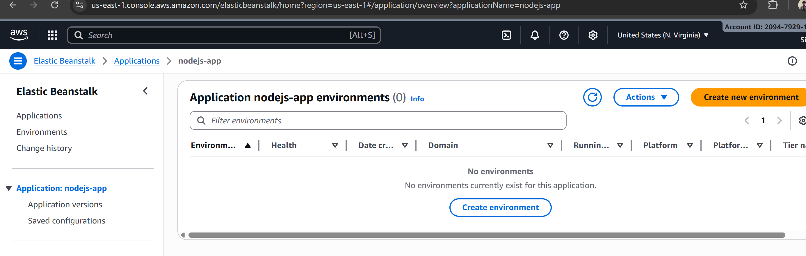

## Creating Environment

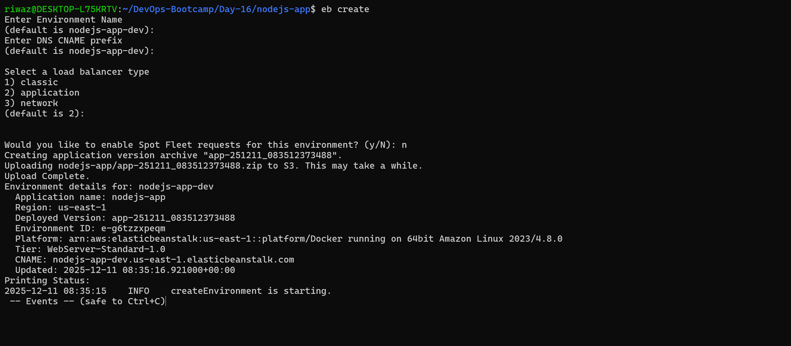

## Verifying the deployment

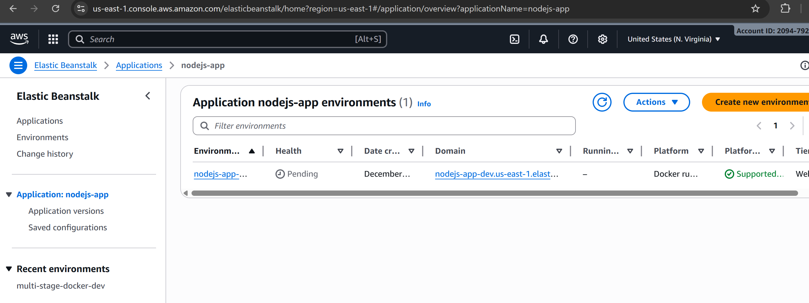

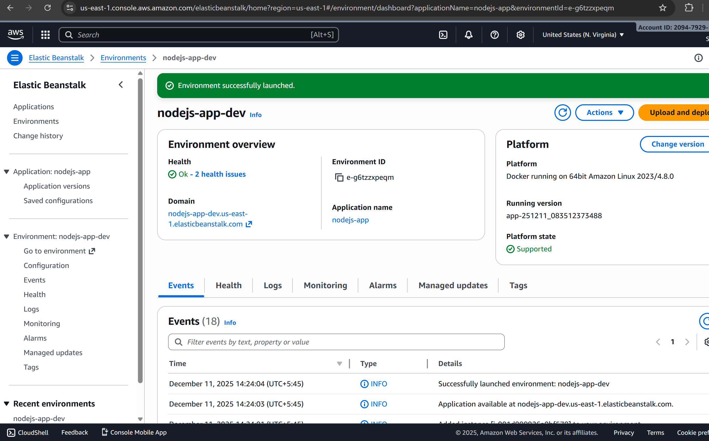

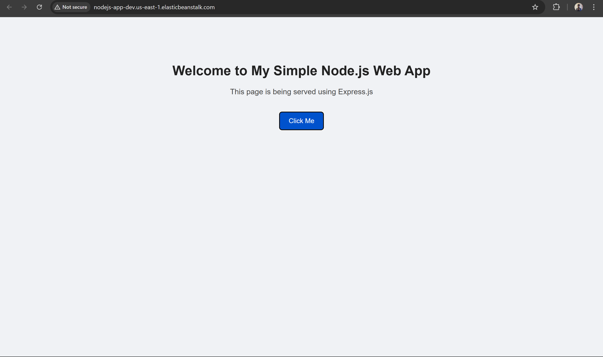
