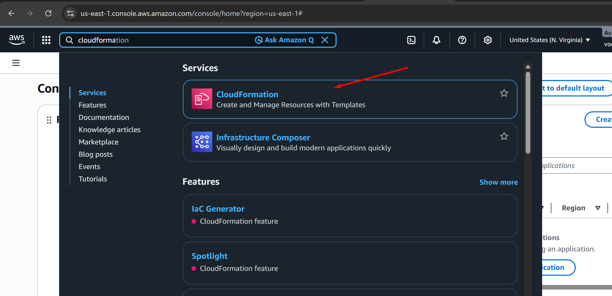

# Deploy and document EC2 with CloudFormation

ec2.yaml

```jsx
AWSTemplateFormatVersion: "2010-09-09"
Description: CloudFormation template to create a VPC, IGW, subnet, route table, SG, and EC2 instance.

Parameters:
  KeyPair:
    Type: AWS::EC2::KeyPair::KeyName
    Description: Choose an existing KeyPair

Resources:
  VPC:
    Type: AWS::EC2::VPC
    Properties:
      CidrBlock: 10.0.0.0/16
      EnableDnsSupport: true
      EnableDnsHostnames: true
      Tags:
        - Key: Name
          Value: Riwaj-VPC

  InternetGateway:
    Type: AWS::EC2::InternetGateway
    Properties:
      Tags:
        - Key: Name
          Value: RiwajInternetGateway

  VPCGatewayAttachment:
    Type: AWS::EC2::VPCGatewayAttachment
    Properties:
      VpcId: !Ref VPC
      InternetGatewayId: !Ref InternetGateway

  Subnet:
    Type: AWS::EC2::Subnet
    Properties:
      VpcId: !Ref VPC
      CidrBlock: 10.0.0.0/24
      AvailabilityZone: us-east-1a
      Tags:
        - Key: Name
          Value: RiwajSubnet

  RouteTable:
    Type: AWS::EC2::RouteTable
    Properties:
      VpcId: !Ref VPC
      Tags:
        - Key: Name
          Value: LabRouteTable

  Route:
    Type: AWS::EC2::Route
    DependsOn: VPCGatewayAttachment
    Properties:
      RouteTableId: !Ref RouteTable
      DestinationCidrBlock: 0.0.0.0/0
      GatewayId: !Ref InternetGateway

  SubnetRouteTableAssociation:
    Type: AWS::EC2::SubnetRouteTableAssociation
    Properties:
      SubnetId: !Ref Subnet
      RouteTableId: !Ref RouteTable

  SecurityGroup:
    Type: AWS::EC2::SecurityGroup
    Properties:
      GroupDescription: Allow SSH and HTTP traffic
      VpcId: !Ref VPC
      SecurityGroupIngress:
        - IpProtocol: tcp
          FromPort: 22
          ToPort: 22
          CidrIp: 0.0.0.0/0
        - IpProtocol: tcp
          FromPort: 80
          ToPort: 80
          CidrIp: 0.0.0.0/0
      Tags:
        - Key: Name
          Value: LabSecurityGroup

  EC2Instance:
    Type: AWS::EC2::Instance
    Properties:
      ImageId: ami-084568db4383264d4 # Ubuntu 24.04 LTS (us-east-1)
      InstanceType: t3.micro
      KeyName: !Ref KeyPair
      SubnetId: !Ref Subnet
      SecurityGroupIds:
        - !Ref SecurityGroup

      BlockDeviceMappings:
        - DeviceName: /dev/sda1
          Ebs:
            VolumeType: gp2
            VolumeSize: 20
            DeleteOnTermination: true

      UserData:
        Fn::Base64: |
          #!/bin/bash
          apt update -y
          apt install -y apache2
          systemctl start apache2
          systemctl enable apache2
          echo "<h1>Deployed via AWS CloudFormation</h1>" > /var/www/html/index.html

      Tags:
        - Key: Name
          Value: Riwaj-EC2

  ElasticIP:
    Type: AWS::EC2::EIP
    Properties:
      Domain: vpc
      InstanceId: !Ref EC2Instance
      Tags:
        - Key: Name
          Value: Riwaj-ElasticIP

Outputs:
  ElasticIPPublicIP:
    Value: !GetAtt ElasticIP.PublicIp
    Description: The Public IP address associated with the Elastic IP address.
  PrivateIp:
    Value: !GetAtt EC2Instance.PrivateIp
    Description: The private IP address of the specified instance.
  PublicDnsName:
    Value: !GetAtt EC2Instance.PublicDnsName
    Description: The public DNS name of the specified instance.
  PublicIp:
    Value: !GetAtt EC2Instance.PublicIp
    Description: The public IP address of the specified instance.

```

## Uploading CFT template via console




## Uploading ec2.yaml file


## Verifying Stack via Events


## Verifying components of EC2


### Verifying deployed file via broswer


# **Using AWS - CLI**

## Configuring AWS


## Validating the template

```jsx
aws cloudformation validate-template \
--template-body file://ec2.yaml
```


## Creating stack

```jsx
aws cloudformation create-stack \
--stack-name Riwaj-Stack \
--template-body file://ec2.yaml \
--parameters ParameterKey=KeyPair,ParameterValue=Riwaj-Key \
--capabilities CAPABILITY_NAMED_IAM
```


## Checking Stack status

```jsx
aws cloudformation describe-stacks \
--stack-name Riwaj-Stack
```


## Verifying from Events


## Verifying the deployed file

