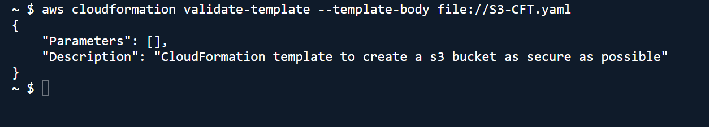

# Write a CFT for provisioning a S3 Bucket . Make it as secure as possible.


S3-CFT.yaml

```jsx
AWSTemplateFormatVersion: "2010-09-09"
Description: CloudFormation template to create a s3 bucket as secure as possible

# Parameters:
#   IAMUserArn:
#     Type: String
#     Description: ARN of the IAM User allowed to access the bucket

Resources:
  S3BUCKETLOGS:
    Type: AWS::S3::Bucket
    DeletionPolicy: Retain
    UpdateReplacePolicy: Retain
    Properties:
      BucketName: riwajs3access_logbucket986598659865
      PublicAccessBlockConfiguration:
        BlockPublicAcls: true
        BlockPublicPolicy: true
        IgnorePublicAcls: true
        RestrictPublicBuckets: true
      BucketEncryption:
        ServerSideEncryptionConfiguration:
          - ServerSideEncryptionByDefault:
              SSEAlgorithm: AES256
      VersioningConfiguration:
        Status: Enabled
      OwnershipControls:
        Rules:
          - ObjectOwnership: BucketOwnerEnforced
      Tags:
        - Key: Name
          Value: riwajs3access_logbucket
        - Key: Environment
          Value: Dev
  S3BucketLogPolicy:
    Type: AWS::S3::BucketPolicy
    Properties:
      Bucket: !Ref S3BUCKETLOGS
      PolicyDocument:
        Version: '2012-10-17'
        Statement:
          - Sid: AllowS3ServerAccessLogs
            Effect: Allow
            Principal:
              Service: logging.s3.amazonaws.com
            Action: s3:PutObject
            Resource: !Sub 'arn:aws:s3:::${S3BUCKETLOGS}/*'
            Condition:
              StringEquals:
                s3:x-amz-acl: bucket-owner-full-control
  S3BUCKET:
    Type: AWS::S3::Bucket
    DeletionPolicy: Retain
    UpdateReplacePolicy: Retain
    Properties:
      BucketName: riwajs3bucket98659865986500

      PublicAccessBlockConfiguration:
        BlockPublicAcls: true
        BlockPublicPolicy: true
        IgnorePublicAcls: true
        RestrictPublicBuckets: true

      BucketEncryption:
        ServerSideEncryptionConfiguration:
          - ServerSideEncryptionByDefault:
              SSEAlgorithm: AES256
      
      VersioningConfiguration:
        Status: Enabled

      OwnershipControls:
        Rules:
          - ObjectOwnership: BucketOwnerEnforced
      LoggingConfiguration:
        DestinationBucketName: !Ref S3BUCKETLOGS
        LogFilePrefix: access_logs/
      Tags:
        - Key: Name
          Value: Secureriwajbucket
        - Key: Environment
          Value: Dev

  HttpsBucketPolicy:
    Type: AWS::S3::BucketPolicy
    Properties:
      Bucket: !Ref S3BUCKET
      PolicyDocument:
        Version: "2012-10-17"
        Statement:
          - Sid: DenyInsecureTransport
            Effect: Deny
            Principal: '*'
            Action: 's3:*'
            Resource:
              - !Sub "arn:aws:s3:::${S3BUCKET}"
              - !Sub "arn:aws:s3:::${S3BUCKET}/*"
            Condition:
              Bool:
                'aws:SecureTransport': false
          
          - Sid: DenynUnencryptedObjectUploads
            Effect: Deny
            Principal: '*'
            Action: 's3:PutObject'
            Resource:
              - !Sub "arn:aws:s3:::${S3BUCKET}/*"
            Condition:
              StringNotEquals:
                s3:x-amz-server-side-encryption: AES256
            
          # - Sid: AllowSpecificIAMUserAccess
          #   Effect: Allow
          #   Principal:
          #     AWS: !Ref IAMUserArn
          #   Action:
          #     - s3:GetObject
          #     - s3:PutObject
          #   Resource: !Sub "arn:aws:s3:::${S3BUCKET}/*"
Outputs:
  BucketName:
    Description: Secure S3 Bucket Name
    Value: !Ref S3BUCKET

  BucketArn:
    Description: Secure S3 Bucket ARN
    Value: !GetAtt S3BUCKET.Arn

  AccessLogsBucket:
    Description: S3 Access Log Bucket Name
    Value: !Ref S3BUCKETLOGS
```

## Block 1: Parameters

Here this section allows a specific IAM user/role to access our bucket, which is beneficial for least privilege access as we don't have access to IAM permissions i have commented it out.

## Block 2: Resources

1. S3Bucket
    
    Here we have defined DeletionPolicy  as Retains which prevents the bucket from being dedleted if stack is deleted and protects the data and UdateRepalcePolicy ensures bucket is retained if resource is replaced during update.
    
    ```jsx
    Resources:
      S3BUCKET:
        Type: AWS::S3::Bucket
        DeletionPolicy: Retain
        UpdateReplacePolicy: Retain
        Properties:
          BucketName: riweajs3bucket98659865986
    ```
    

1. Public Access Block:
    
    Here we have configured 
    
    - BlockPublicAcls which prevents setting public ACL on the objects.
    - BlockPublicPolicy which prevents bucket policies from granting public access.
    - IgnorePublicAcls which ignores any current public ACL on objects.
    - RestrictPublicBuckets which denies cross account policies.
    
    ```jsx
    PublicAccessBlockConfiguration:
            BlockPublicAcls: true
            BlockPublicPolicy: true
            IgnorePublicAcls: true
            RestrictPublicBuckets: true
    ```
    

1. Bucket Encryption
    
    Here we have used SSE-S3 which is a managed S3 encryption algorithm. This ensures all the stored objects in the bucket are encrypted at rest.
    
    ```jsx
     BucketEncryption:
            ServerSideEncryptionConfiguration:
              - ServerSideEncryptionByDefault:
                  SSEAlgorithm: AES256
    ```
    

1. Versioning Enabling
    
    This cinfigure enbales object versioning in our bucket.
    
    ```jsx
    VersioningConfiguration:
            Status: Enabled
    ```
    

1. Ownership Controls and Tags
    
    Here the Ownership ocntrols configurations ensures the bucket owner automatically owns all the objects even if uploaded by other, preventing unexpexted aceess issues. Also we have defined tags which is a metadata for the bucket.
    
    ```jsx
    OwnershipControls:
            Rules:
              - ObjectOwnership: BucketOwnerEnforced
          Tags:
            - Key: Name
              Value: Secureriwajbucket
            - Key: Environment
              Value: Dev
    ```
    

1. Bucket policy
    
    Here i have defined a bucket policy name HttpsBucketPolicy which attaches the policies directly to the buckets.
    
    ```jsx
    HttpsBucketPolicy:
        Type: AWS::S3::BucketPolicy
        Properties:
          Bucket: !Ref S3BUCKET
          PolicyDocument:
            Version: "2012-10-17"
            Statement:
    ```
    

1. Deny HTTP transport
    
    Here this policy denies all the HTTP requests and forcees HTTPS request only on both bucket and objects inside the bucket.
    
    ```jsx
    - Sid: DenyInsecureTransport
                Effect: Deny
                Principal: '*'
                Action: 's3:*'
                Resource:
                  - !Sub "arn:aws:s3:::${S3BUCKET}"
                  - !Sub "arn:aws:s3:::${S3BUCKET}/*"
                Condition:
                  Bool:
                    'aws:SecureTransport': false
    ```
    

1. Deny Unencrypted Object upload
    
    Denies object uploads if SSE is nor applied and ensure all the objects at rest is encrypted.
    
    ```jsx
     - Sid: DenynUnencryptedObjectUploads
                Effect: Deny
                Principal: '*'
                Action: 's3:PutObject'
                Resource:
                  - !Sub "arn:aws:s3:::${S3BUCKET}/*"
    ```
    

1. IAM Access
    
    Here only specific IAM users/roles is allowed access to the bucket.
    
    ```jsx
    - Sid: AllowSpecificIAMUserAccess
                Effect: Allow
                Principal:
                  AWS: !Ref IAMUserArn
                Action:
                  - s3:GetObject
                  - s3:PutObject
                Resource: !Sub "arn:aws:s3:::${S3BUCKET}/*"
    ```
    

1. Outputs
    
    This basically returns bucket name and bucket ARN.
    
    ```jsx
    Outputs:
      BucketName:
        Description: Secure S3 Bucket Name
        Value: !Ref S3BUCKET
    
      BucketArn:
        Description: Secure S3 Bucket ARN
        Value: !GetAtt S3BUCKET.Arn
    ```
    

## Deploying the CFT Template

1. Validating Template
    
    ```jsx
    aws cloudformation validate-template \
    --template-body file://S3-CFT.yaml
    ```
    



1. Deploy the stack
    
    ```jsx
    aws cloudformation create-stack \
    --stack-name SecureS3Stack \
    --template-body file://s3.yaml
    ```
    


1. Check Stack status
    
    ```jsx
    aws cloudformation describe-stacks \
      --stack-name SecureS3Stack
    ```
    
    
    

1. Get Outputs
    
    ```jsx
    aws cloudformation describe-stacks \
      --stack-name SecureS3Stack \
      --query "Stacks[0].Outputs"
    ```
    


1. Verifying bucket existance
    
    ```jsx
    aws s3 ls
    ```
    


1. Verifying via console
    
    
    
    
    
    
    


