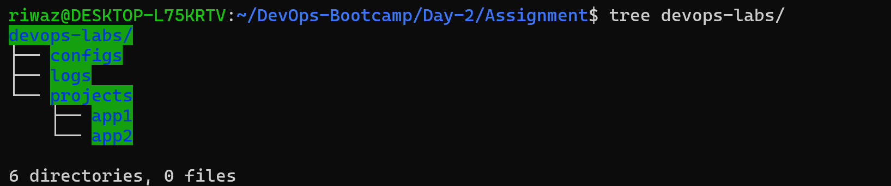
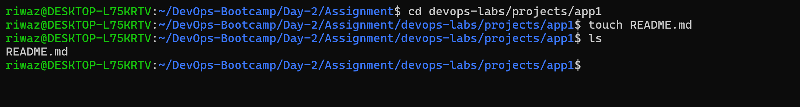
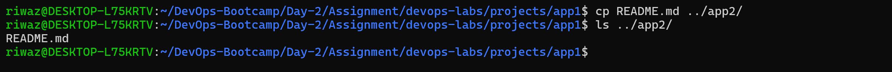
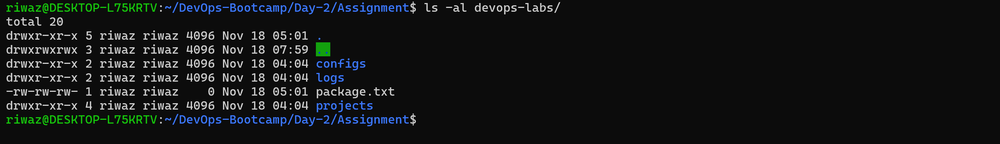

# LINUX COMMAND LINE BASICS

## Creating a direcroty structure

    ```bash
    $ mkdir -p devops-labs/{projects/{app1/,app2/},configs/,logs}
    ```
Here use have use -p flag while is used to create directories with multiple sub-directories.



## Navigating to app1/ and creating README.md file

    ```bash
    $ cd /devops-labs/projects/app1
    ```
Here cd command is used to traverse throught the directories.




## Copying README.md file to app2/ Directory

    ```bash
    $ cp README.md ../app2/
    ```
Here we have used cp command to copy the README.md file to ap2 directory.




## Listing all the files in devops-labe directory with hidden files

    ```bash
    $ ls -al devops-labs/
    ```
Here we have used ls -al to list all the files including hidden files using -a which lists all the files including hidden files and -l will show in long list format.


