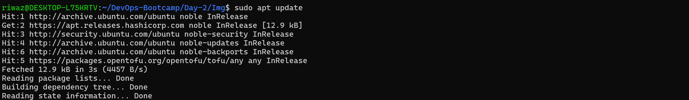
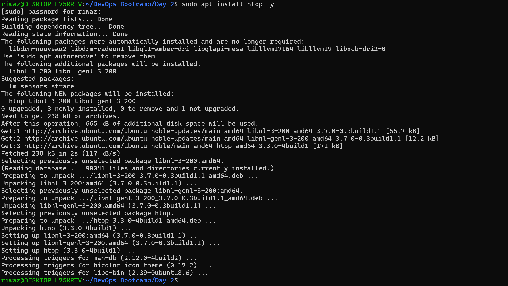
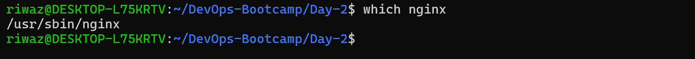
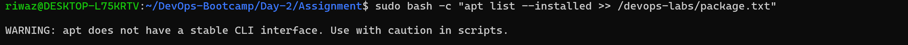
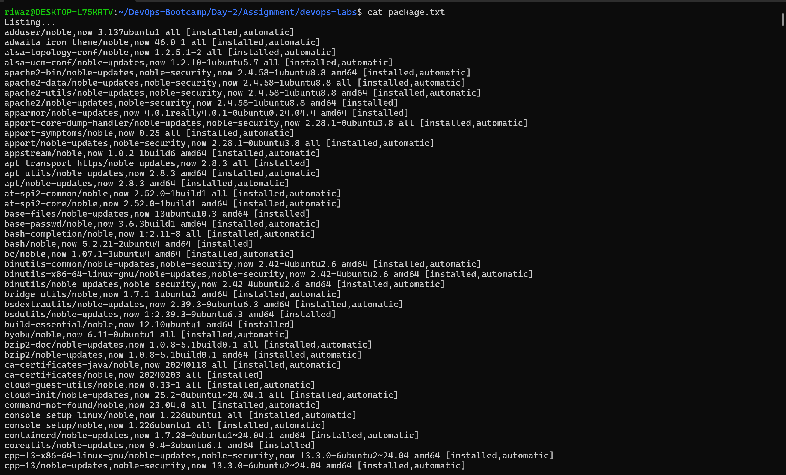

# Task 2: Package Management

## Update package index

    ```bash
    $ sudo apt update
    ```



## Install htop (System monitoring tool)

    ```bash
    $ sudo apt install htop -y
    ```



## Checking if nginx is installed

    ```bash
    $ which nginx
    ```


## If not installed 

    ```bash
    $ apt insatll nginx -y
    ```
## Listing all the packages and saving the output
    
    ```bash
    $ sudo bash -c "apt list --installed >> /devops-labs/package.txt"
    ```




