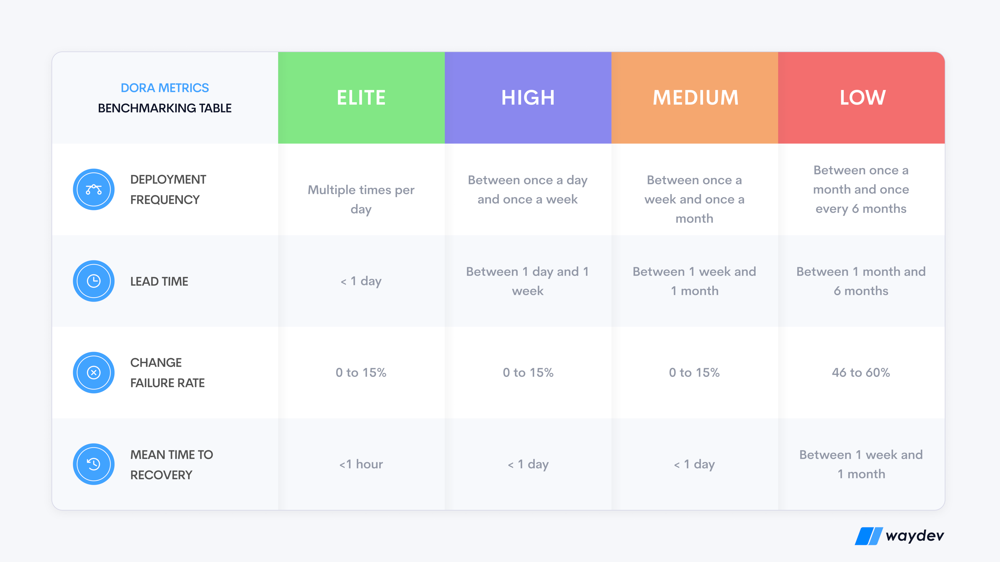

# Task 3: Metrics Calculation

Given the following data for a team over one month:
- Total deployments: 40
- Deployments causing incidents: 6
- Time from commit to production (average): 3 hours
- Incident 1: Detected at 10:00 AM, resolved at 11:30 AM
- Incident 2: Detected at 2:00 PM, resolved at 2:45 PM
- Incident 3: Detected at 9:00 AM, resolved at 11:00 AM
- Incident 4: Detected at 4:00 PM, resolved at 8:00 PM
- Incident 5: Detected at 1:00 PM, resolved at 1:30 PM
- Incident 6: Detected at 11:00 AM, resolved at 3:00 PM

## Calculation

## Deployment Frequency 

Deployment frequency is the measurement of how often the code is deployed to the procduction.
 
    Deployment Frequency= Total Deployments/Total working days

As we know the total deployments are 40 and working days are 20.

    Deployment Frequecy = 40/20 = 2

    The DF is 2 deployments per day.

## Lead Time for Changes

Lead time for change is the measurement of average time from code commit to deployement to production.

    Avg. time from code commit to production = 3

    So the lead time for change is 3 hours.

## Change Failure Rate

Change in failure rate is percentage of deployments that cause failure in production.

    % of deployments causing produciton failure = (failed deployments/total deployments)*100

As we know failed deployments is 6 and total deployments is 40.

    CFR = (6/40)*100
        = 15
    
    The change failure rate is 15%.

## Mean Time to recovery (MTTR)

Mean time to recovery is the avg. time needed to fix the system after failure.

    Time to restore service (MTTR) = recovery time/number of failed deployments

    recovery time = 90+45+120+240+30+240 (from 6 incidents)
                  = 765 minutes or 12.75 hour

    MTTR = 12.75/6
         = 2.125 or 2 hour 7.5 minutes

    So the MTTR is 2 hour 7.5 minutes.

## Classifying based on DORA metrics

    Based on DORA metrics benchmarks the performance is categorized as Elite, high, medium or low.

### DORA Metrics Benchmarks

Here we can see the benchmark for DORA and compare to our above case.

| Metrics               |  Perforamce           |  DORA benchmarks   |
| --------------------- | -------------         | ------------------ |
| Deployment Frequency  |  2 deployments per day|  Elite             |
| Lead Time for Change  |  3 hours              |  Elite             |
| Change failure rate   |  15%                  |  Elite - High      |
| MTTR                  |  approx 2 hour        |  High              |

## Conclusion

As we can see from the DORA benchmarks that we gathered, we can say that the performance of the team is High but very close to Elite. The team can improve on the Lead time for change (< 1 hour) and MTTR (< 1 hour).  
