# Transform EC2 and S3 CloudFormation Templates into Terraform code

# main.tf

```jsx
terraform {
  required_providers {
    aws = {
      source  = "hashicorp/aws"
      version = "6.27.0"
    }
  }
}
provider "aws" {
  region = "us-east-1"
}

data "aws_ami" "ubuntu" {
  most_recent = true
  filter {
    name   = "name"
    values = ["ubuntu/images/hvm-ssd/ubuntu-jammy-22.04-amd64-server-*"]
  }
  owners = ["099720109477"]
}

resource "aws_vpc" "EC2_VPC" {
  cidr_block = "10.0.0.0/16"
  tags = {
    Name = "EC2_VPC"
  }
}

resource "aws_subnet" "EC2_subnet" {
  vpc_id                  = aws_vpc.EC2_VPC.id
  cidr_block              = "10.0.1.0/24"
  availability_zone       = "us-east-1a"
  map_public_ip_on_launch = true
  tags = {
    Name = "EC2-subnet"
  }
}

resource "aws_internet_gateway" "EC2_IGW" {
  vpc_id = aws_vpc.EC2_VPC.id
  tags = {
    Name = "VPC_IGW"
  }
}

resource "aws_route_table" "public_route" {
  vpc_id = aws_vpc.EC2_VPC.id
  route {
    cidr_block = "0.0.0.0/0"
    gateway_id = aws_internet_gateway.EC2_IGW.id
  }
  tags = {
    Name = "public-route"
  }
}

resource "aws_route_table_association" "public-asso" {
  subnet_id      = aws_subnet.EC2_subnet.id
  route_table_id = aws_route_table.public_route.id
}

resource "aws_security_group" "EC2SG" {
  name   = "EC2SG"
  vpc_id = aws_vpc.EC2_VPC.id
  ingress {
    from_port   = 22
    to_port     = 22
    protocol    = "tcp"
    cidr_blocks = ["0.0.0.0/0"]
  }
  egress {
    from_port   = 0
    to_port     = 0
    protocol    = "-1"
    cidr_blocks = ["0.0.0.0/0"]
  }
  tags = {
    Name = "EC2SG"
  }
}

resource "aws_instance" "server" {
  ami                    = data.aws_ami.ubuntu.id
  vpc_security_group_ids = [aws_security_group.EC2SG.id]
  subnet_id              = aws_subnet.EC2_subnet.id
  instance_type          = "t3.micro"
  tags = {
    Name = "My-Server"
  }
}

resource "aws_s3_bucket" "logbucket" {
  bucket = "riwajlogbucket9865990000"
  tags = {
    Name = "S3-log-bucket"
  }
}

resource "aws_s3_bucket_public_access_block" "block_public_log" {
  bucket                  = aws_s3_bucket.logbucket.id
  block_public_acls       = true
  block_public_policy     = true
  ignore_public_acls      = true
  restrict_public_buckets = true
}

resource "aws_s3_bucket_server_side_encryption_configuration" "SSE_log" {
  bucket = aws_s3_bucket.logbucket.id
  rule {
    apply_server_side_encryption_by_default {
      sse_algorithm = "AES256"
    }
  }
}

resource "aws_s3_bucket_versioning" "version_log" {
  bucket = aws_s3_bucket.logbucket.id
  versioning_configuration {
    status = "Enabled"
  }
}

resource "aws_s3_bucket_ownership_controls" "OC_log" {
  bucket = aws_s3_bucket.logbucket.id
  rule {
    object_ownership = "BucketOwnerEnforced"
  }
}

data "aws_caller_identity" "current" {}
data "aws_iam_policy_document" "log_bucket_policy" {
  statement {
    sid    = "AllowS3LoggingAcl"
    effect = "Allow"
    principals {
      type        = "Service"
      identifiers = ["logging.s3.amazonaws.com"]
    }
    actions = [
      "s3:GetBucketAcl"
    ]
    resources = [
      aws_s3_bucket.logbucket.arn
    ]
  }
  statement {
    sid    = "AllowS3LoggingWrite"
    effect = "Allow"
    principals {
      type        = "Service"
      identifiers = ["logging.s3.amazonaws.com"]
    }
    actions = [
      "s3:PutObject"
    ]
    resources = [
      "${aws_s3_bucket.logbucket.arn}/access_logs/*"
    ]
    condition {
      test     = "StringEquals"
      variable = "aws:SourceAccount"
      values   = [data.aws_caller_identity.current.account_id]
    }

    condition {
      test     = "ArnLike"
      variable = "aws:SourceArn"
      values   = [aws_s3_bucket.main_bucket.arn]
    }
  }
}

resource "aws_s3_bucket_policy" "log_bucket" {
  bucket     = aws_s3_bucket.logbucket.id
  policy     = data.aws_iam_policy_document.log_bucket_policy.json
  depends_on = [aws_s3_bucket_public_access_block.block_public_log]
}

resource "aws_s3_bucket" "main_bucket" {
  bucket = "riwajbucket9865990000"
  tags = {
    Name = "my_s3"
  }
}
resource "aws_s3_bucket_public_access_block" "block_public_main" {
  bucket                  = aws_s3_bucket.main_bucket.id
  block_public_acls       = true
  block_public_policy     = true
  ignore_public_acls      = true
  restrict_public_buckets = true
}

resource "aws_s3_bucket_server_side_encryption_configuration" "SSE_main" {
  bucket = aws_s3_bucket.main_bucket.id
  rule {
    apply_server_side_encryption_by_default {
      sse_algorithm = "AES256"
    }
  }
}

resource "aws_s3_bucket_versioning" "version_main" {
  bucket = aws_s3_bucket.main_bucket.id
  versioning_configuration {
    status = "Enabled"
  }
}

resource "aws_s3_bucket_ownership_controls" "OC_main" {
  bucket = aws_s3_bucket.main_bucket.id
  rule {
    object_ownership = "BucketOwnerEnforced"
  }
}

resource "aws_s3_bucket_logging" "main_log" {
  bucket        = aws_s3_bucket.main_bucket.id
  target_bucket = aws_s3_bucket.logbucket.id
  target_prefix = "access_logs/"
}

data "aws_iam_policy_document" "TLS_main" {
  statement {
    sid    = "DenyInsecureTransport"
    effect = "Deny"
    principals {
      type        = "*"
      identifiers = ["*"]
    }
    actions = [
      "s3:*"
    ]
    resources = [
      aws_s3_bucket.main_bucket.arn,
      "${aws_s3_bucket.main_bucket.arn}/*",
    ]
    condition {
      test     = "Bool"
      variable = "aws:SecureTransport"
      values   = ["false"]
    }
  }
}

resource "aws_s3_bucket_policy" "TLS_main" {
  bucket = aws_s3_bucket.main_bucket.id
  policy = data.aws_iam_policy_document.TLS_main.json
}
```

Terraform block & provides

The terraform {} block configures Terraform itself, including which providers to install, and which version of Terraform to use to provision your infrastructure. 

The **`provider`** block configures options that apply to all resources managed by your provider, such as the region to create them in. 

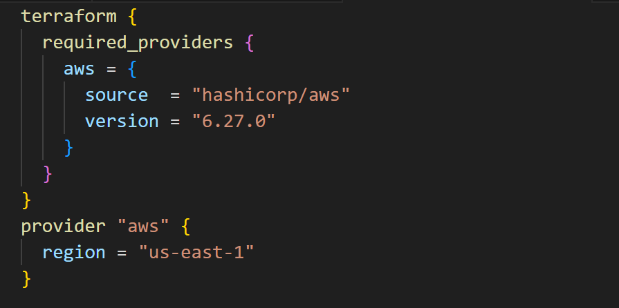

Data Source for AMI

**Data Source** is a way to fetch information that already exists in your cloud provider (AWS) but wasn't necessarily created by our current Terraform code.

 Instead of hardcoding a specific AMI ID, we told Terraform: "Go look for the latest Ubuntu 22.04 image owned by Canonical."

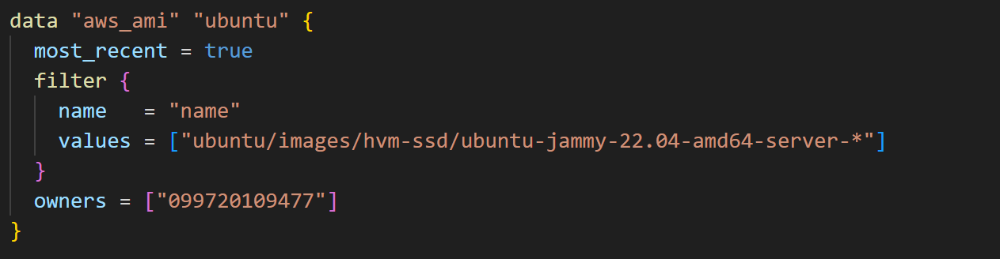

Defining resources for Ec2 instance

Here in resource block we configure all the necessary components in order to create our EC2 instance such as VPC, IGW, route table, public IP, security group, etc.

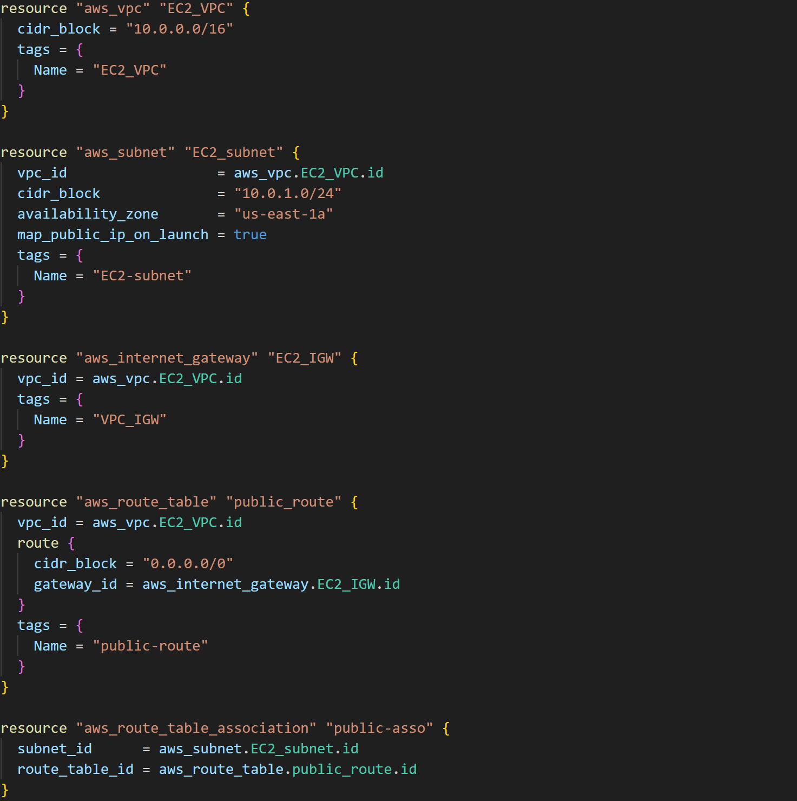

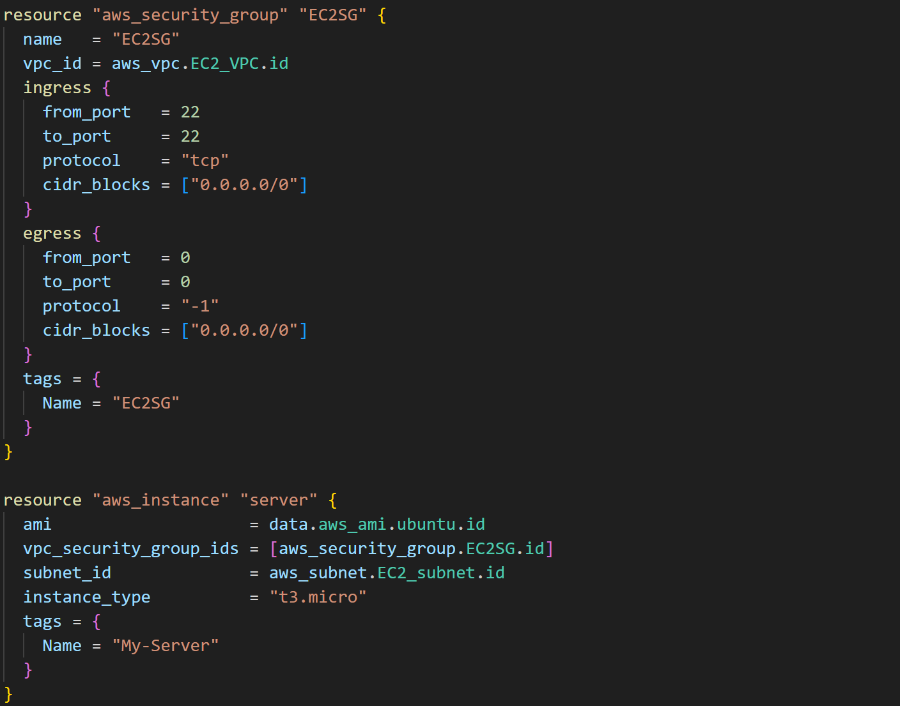

Creating S3 bucket for logging

Here we have create s3 bucket for logging.

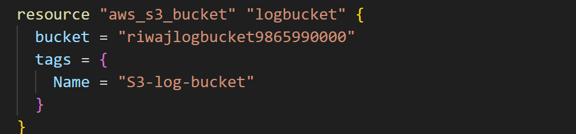

Blocking public access in S3 bucket and enabling encryption

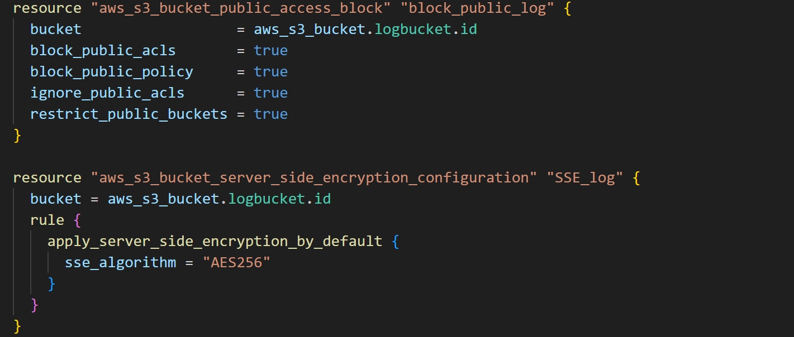

Enabling versioning and Ownership controls


Configuring bucket policy

Here the data source fetches the account ID of the current user and we have defined bucket policy for the log bucket.

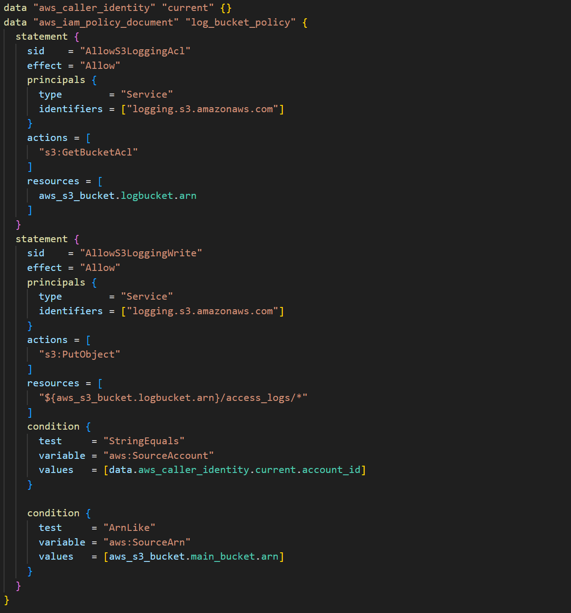

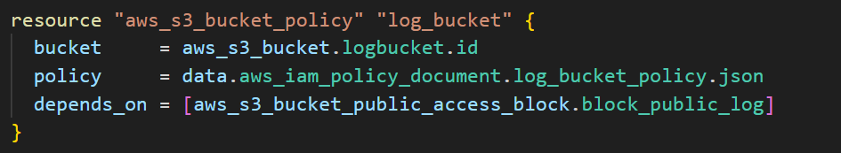

Creating our main S3 bucket

Here we have created main  s3 bucket .

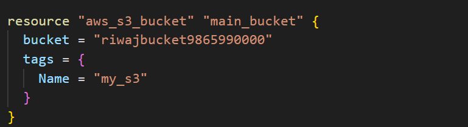

Blocking public access in S3 bucket and enabling encryption

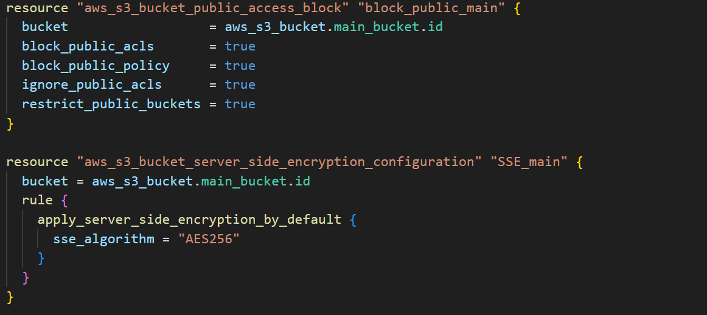

Enabling versioning and Ownership controls

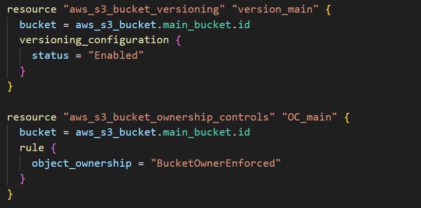

Logging configuration

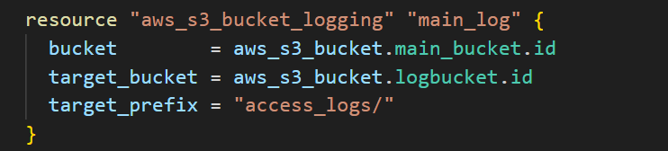

Bucket policy configuration

Here in this bucket policy we have configured a policy that denies any insecure transport.

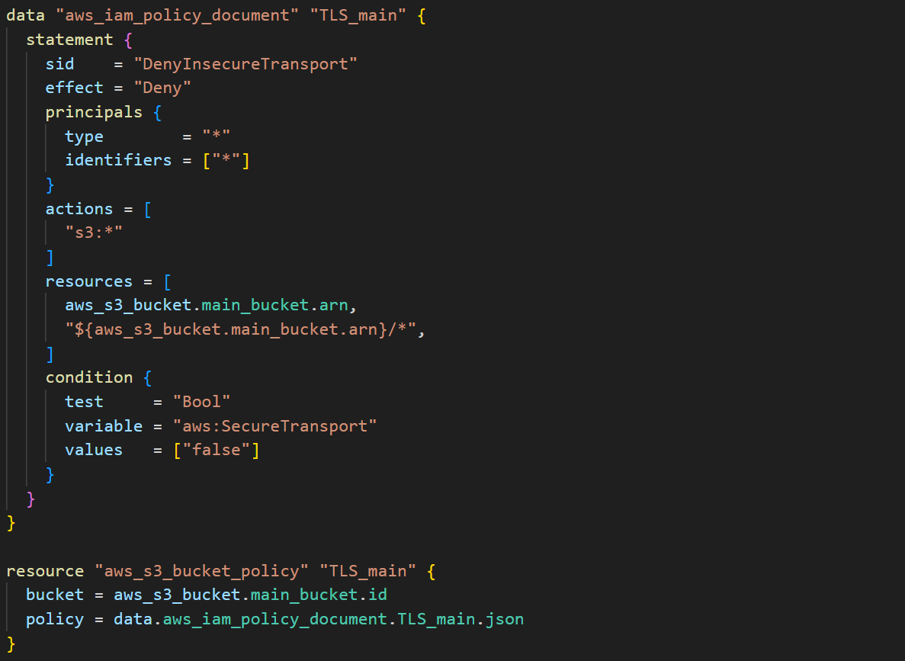