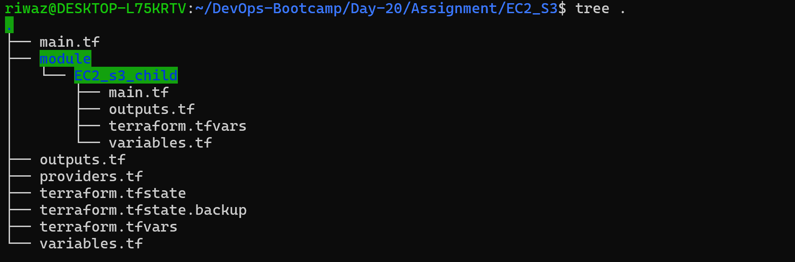

# Make a new branch and commit the changes relating to Variable and Outputs usage on another branch.

## Committing code changes to GitHub


## Switch to new Branch


## Create [variables.tf](http://variables.tf) file

Here we have created [variables.tf](http://variables.tf) which parameterizes our infrastructure which makes our code reusable and secure.

```jsx
variable "region" {
  description = "Aws region"
  type        = string
  default     = "us-east-1"
}

variable "instance_type" {
  description = "Ec2 instance type"
  type        = string
  default     = "t3.micro"

  validation {
    condition     = contains(["t3.micro", "t2.medium", "t2.large"], var.instance_type)
    error_message = "Instance must be t3.micro, t2.mediumor t2.large."
  }
}

variable "vpc_cidr" {
  description = "CIDR block for VPC"
  type        = string
  default     = "10.0.0.0/16"
}

variable "public_subnet_cidr" {
  description = "cidr for public subnet"
  type        = string
  default     = "10.0.1.0/24"
}

variable "availability_zone" {
  description = "Availability zone for subnet"
  type        = string
  default     = "us-east-1a"

  validation {
    condition     = contains(["us-east-1a", "us-east-1b", "us-east-1c"], var.availability_zone)
    error_message = "Availability ZOnes must be us-east-1a, us-east-1b or us-east-1c "
  }
}

variable "public_route" {
  description = "public route for public subnet"
  type        = string
  default     = "0.0.0.0/0"
}

variable "log_bucket_name" {
  type = string
}

variable "main_bucket_name" {
  type = string
}
```

## Replace the hardcode elements with variables across main.tf

Here we then update our existing [main.tf](http://main.tf) file where we call the variables defined in [variables.tf](http://variables.tf) file instead of hardcoding the values.



## Create terraform.tfvars file

Then we have created terraform.tfvars files in order to avoid hardcoding values in our [main.tf](http://main.tf) file make it clean and reusable.

```jsx
log_bucket_name  = "riwajlogbucket9865990000"
main_bucket_name = "riwajbucket9865990000"
```

## Create [outputs.tf](http://outputs.tf) file

Here we have created [outputs.tf](http://outputs.tf) file for ease of visibility and the only way to expose values.

```jsx
output "region" {
  description = "AWS region"
  value       = var.region
}

output "vpc_id" {
  description = "VPC ID"
  value       = aws_vpc.EC2_VPC
}

output "instance_id" {
  description = "Id of instance"
  value       = aws_instance.server.id
}

output "EC2_public_ip" {
  description = "public Ip of Ec2 instance"
  value       = aws_instance.server.public_ip
}

output "log_bucket_name" {
  description = "Name of Log bucket"
  value       = aws_s3_bucket.logbucket.bucket
}

output "main_bucket_name" {
  description = "Name of Main bucket"
  value       = aws_s3_bucket.main_bucket.bucket
}
```

## Verification

