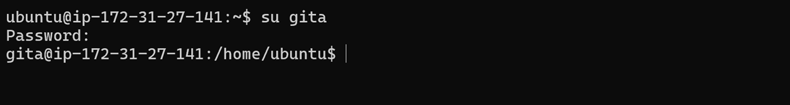
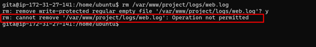
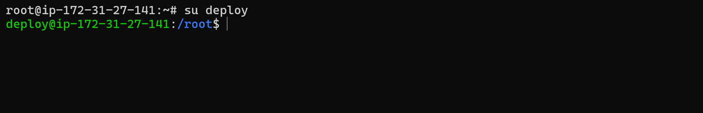

# Task 5: Verification and Testing

## 5.1 Testing shared directory

### Switch user

### creating a file

### Verify group ownership

## 5.2 Testing log sticky bit

### Switch to gita

### Trying to delete the log file

## 5.3 Testing SUID on deploy.sh

### Switch to deploy

### Running the Script

